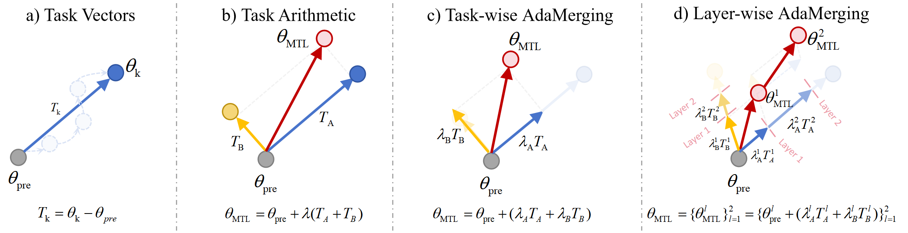

# AdaMerging

A repository of **'[AdaMerging: Adaptive Model Merging for Multi-Task Learning](https://arxiv.org/abs/2310.02575). ICLR, 2024.'**.


## Abstract
> Multi-task learning (MTL) aims to empower a model to tackle multiple tasks simultaneously. A recent development known as task arithmetic has revealed that several models, each fine-tuned for distinct tasks, can be directly merged into a single model to execute MTL without necessitating a retraining process using the initial training data. Nevertheless, this direct addition of models often leads to a significant deterioration in the overall performance of the merged model. This decline occurs due to potential conflicts and intricate correlations among the multiple tasks. Consequently, the challenge emerges of how to merge pre-trained models more effectively without using their original training data. This paper introduces an innovative technique called Adaptive Model Merging (AdaMerging). This approach aims to autonomously learn the coefficients for model merging, either in a task-wise or layer-wise manner, without relying on the original training data. Specifically, our AdaMerging method operates as an automatic, unsupervised task arithmetic scheme. It leverages entropy minimization on unlabeled test samples from the multi-task setup as a surrogate objective function to iteratively refine the merging coefficients of the multiple models. Our experimental findings across eight tasks demonstrate the efficacy of the AdaMerging scheme we put forth. Compared to the current state-of-the-art (SOTA) task arithmetic merging scheme, AdaMerging showcases a remarkable 11\% improvement in performance. Notably, AdaMerging also exhibits superior generalization capabilities when applied to unseen downstream tasks. Furthermore, it displays a significantly enhanced robustness to data distribution shifts that may occur during the testing phase.

<center>

</center>


## Citation
If you find our paper or this resource helpful, please consider cite:
```
@article{AdaMerging_ICLR_2024,
  title={AdaMerging: Adaptive Model Merging for Multi-Task Learning},
  author={Yang, Enneng and Wang, Zhenyi and Shen, Li and Liu, Shiwei and Guo, Guibing and Wang, Xingwei and Tao, Dacheng},
  journal={The Twelfth International Conference on Learning Representations},
  year={2024}
}
```
Thanks!


## Checkpoints

You can download the fine-tuned checkpoints from the [task_vectors#checkpoints](https://github.com/mlfoundations/task_vectors#checkpoints).
The Google Drive folder is: [task_vectors_checkpoints](https://drive.google.com/drive/folders/1u_Tva6x0p6oxu5Eo0ZZsf-520Cc_3MKw)

## Code

### Train

**If you want to train AdaMerging, run this part of the code. If you want to load the trained merging coefficients directly, refer to the Eval section.**

First enter the root directory of the source code.
> cd root_path/src/

Run Task Atithmetic [paper](https://arxiv.org/abs/2212.04089)
> python main_task_arithmetic.py

Run TIES-MERGING [paper](https://arxiv.org/abs/2306.01708)
> python main_ties_merging.py

Run Task-wise AdaMerging (Ours) [paper](https://arxiv.org/abs/2310.02575)
> python main_task_wise_adamerging.py

Run Task-wise AdaMerging++ (Ours) [paper](https://arxiv.org/abs/2310.02575)
> python main_task_wise_adamergingpp.py

Run Layer-wise AdaMerging (Ours) [paper](https://arxiv.org/abs/2310.02575)
> python main_layer_wise_adamerging.py

Run Layer-wise AdaMerging++ (Ours) [paper](https://arxiv.org/abs/2310.02575)
> python main_layer_wise_adamergingpp.py

### Eval
Alternatively, you can load our trained merge coefficients, which can be found in the *merging_coefficient.py* file. The general process is as follows:

```
# load
from merging_cofficient import get_merging_cofficients
ralpha = get_merging_cofficients(method_name, model_name)  
self.alpha = torch.Tensor(ralpha)

# wrap
if self.alpha.size()[0] == 1:# task-wise merging
    params = tuple(sum(tuple(pi * alphai for pi, alphai in zip(p, self.alpha[0].cpu()))) for j, p in enumerate(zip(*self.paramslist)))
else: # layer-wise merging
    params = tuple(sum(tuple(pi * alphai for pi, alphai in zip(p, self.alpha[j].cpu()))) for j, p in enumerate(zip(*self.paramslist)))
```


## Acknowledgement
Our implementation references the code below, thanks to them.

[Task Arithmetic](https://github.com/mlfoundations/task_vectors), [TIES-MERGING](https://github.com/prateeky2806/ties-merging/tree/main), [Model Soups](https://github.com/mlfoundations/model-soups)
